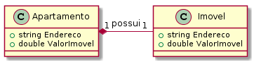

Você está desenvolvendo uma aplicação para uma imobiliária.

Essa aplicação tem uma classe chamada `Apartamento`, que contém uma instância da classe `Imovel`. 



Porém, durante a revisão de código, você percebe que a classe `Apartamento` está usando todos os membros da classe `Imovel`:

```
class Apartamento
{
    private readonly Imovel imovel;
    private decimal valorCondominio;

    public string Endereco => imovel.Endereco;
    public decimal ValorImovel { get => imovel.ValorImovel; set => imovel.ValorImovel = value; }

    public Apartamento(string endereco, decimal valorImovel, decimal valorCondominio)
    {
        this.imovel = new Imovel(endereco, valorImovel);
        this.valorCondominio = valorCondominio;
    }
}

```

Que técnica de refatoração você implementaria nesse cenário? Escolha a melhor alternativa.

B- Substituir Delegação por Herança
Isso aí! Como classe `Apartamento` é uma **especialização** da classe `Imovel` (pois contém todos os
membros desta **mais** a informação de condomínio), devemos substituir a delegação por herança.

A- Substituir Herança por Delegação 
Ops! Pelo código sabemos que a classe `Apartamento` já está fazendo delegação para a classe `Imovel`.

C- Colapsar Hierarquia
Ops! Ambas as classes são bem definidas, úteis e distintas, portanto não podemos
substituí-las por uma única classe.

D- Extrair Classe
Ops! Extrair classe não irá resolver o problema mais evidente, que é
o fato de a classe `Apartamento` ser uma especialização da classe `Imovel` e não utilizar herança.

